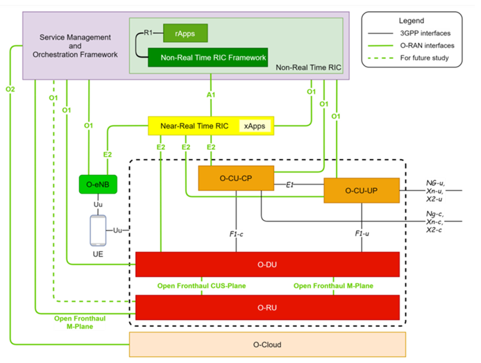
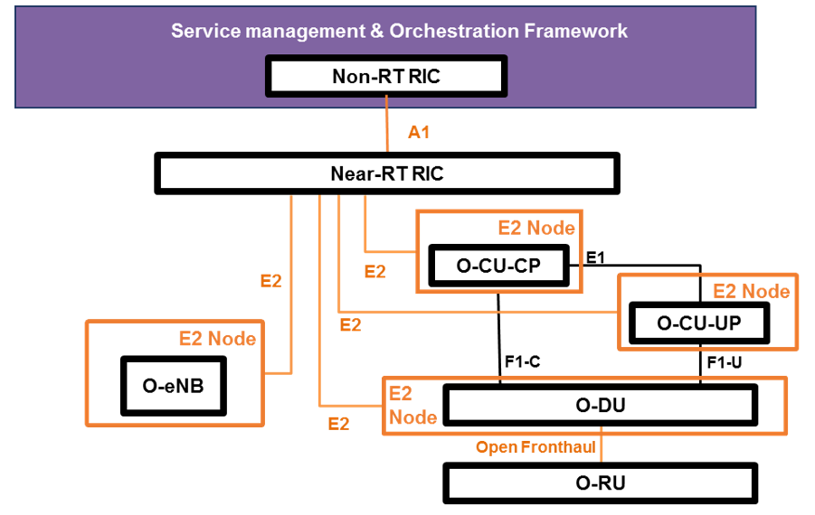
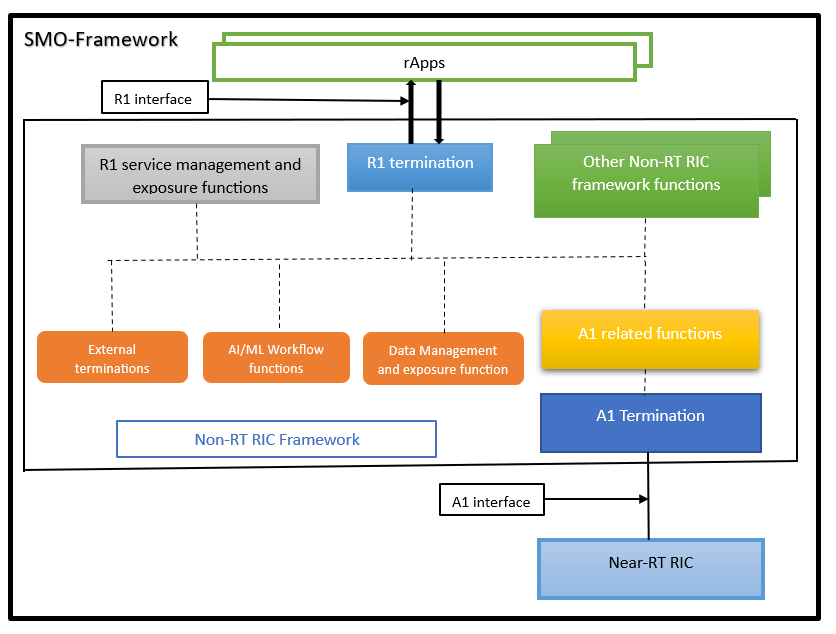
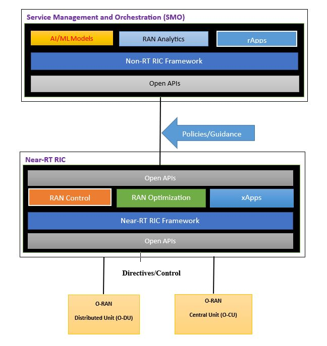

# RP-Evaluation-of-5G-Open-Radio-Access-Network-Simulation-Environments.
## 1 Introduction

The rise of 5G networks has become crucial to meeting the growing demand for fast data transmission and improved network capacity. The Open Radio Access Network (O-RAN) architecture offers a solution to enhance the flexibility and interoperability of 5G networks. To ensure the successful deployment and optimization of O-RAN, it is essential to evaluate and test its components and functionalities. Simulating O-RAN in controlled environments provides a costeffective way to assess its performance.

This research project aims to evaluate simulation environments for deploying O-RAN. By analyzing simulation tools and methodologies, this study aims to identify their components and suitability for simulating O-RAN. Additionally, this research will test the connectivity of components and create a service using the Open Network Automation Platform (ONAP). This platform was introduced by the O-RAN Alliance software community.

O-RAN Alliance has developed O-RAN components and published their releases, including this research paper based on G-Release. G-Release is developed on Docker and Kubernetes, and this research followed Kubernetes implementation. 
Apart from that, this Kubernetes implementation needs additional support from Docker and Helm Chart.

**Kubernetes**: Kubernetes, an open-source container orchestration platform, revolutionizes how applications are deployed, scaled, and managed. Initially created by Google and overseen by the Cloud Native Computing Foundation, Kubernetes provides developers with a powerful and intuitive solution to handle applications across server clusters or virtual machines effectively. By abstracting the complexities of the underlying infrastructure, it offers features such as load balancing, automatic scaling, and storage orchestration. With its widespread adoption, Kubernetes has emerged as the de facto standard for container orchestration, empowering the development of resilient and scalable cloud-native solutions.

**Docker for Kubernetes**: Docker is a platform that helps automate the deployment of applications using containers. In Kubernetes, Docker is used as the container runtime. It allows applications to be packaged as Docker images, which are portable and self-contained. Kubernetes utilizes Docker to manage and run these containers on a cluster, making it easier to scale and deploy applications efficiently. Together, Docker and Kubernetes provide developers with the ability to build, package, and manage applications in a containerized environment.

**Helm Chart**: Helm emerges as a convenient package manager designed specifically for Kubernetes, streamlining the process of deploying and managing applications. With Helm, applications can be packaged into Helm Charts, which consist of multiple files that configure and encapsulate Kubernetes resources. This packaging approach enables effortless 
nstallation and consistent management of applications, fostering repeatability and ease of use. By providing a standardized mechanism for defining, sharing, and deploying applications, Helm significantly simplifies the management of complex applications while promoting seamless collaboration among teams.

Chapter 2 will detail information about the O-RAN Alliance and the ecosystem. Apart from that, the O-RAN architecture [Figure 1] will be presented, along with complete information on every component of O-RAN.

In Chapter 3, possible solutions with an environment for the deployment of virtual infrastructure able to deploy O-RAN RIC components are discussed—moreover, a detailed description of prerequisite installation steps with necessary commands and example output.

Next, Chapter 4 will describe the steps to connect RIC components and create a service between them. In addition, in the result section, there is a Wireshark capture and analysis of packets.

# 2 O-RAN Alliance and O-RAN Ecosystem
**2.1 O-RAN Alliance Overview**

The O-RAN Alliance was established with the primary objective of advancing openness and intelligence within the Radio Access Network (RAN) industry. Since its inception, the alliance has garnered significant momentum, attracting over 200 members, including major mobile operators, network equipment vendors, and system integrators.

A key focus of the O-RAN Alliance is the development of open interface specifications that facilitate multi-vendor interoperability and enable the deployment of virtualized RAN solutions. These open interfaces empower network operators to select and integrate components from different vendors, fostering competition and avoiding vendor lock-in. To ensure compliance with the alliance’s specifications and promote interoperability, the organization offers testing and certification services. This ensures that RAN components from various vendors can seamlessly work together, reducing the risk of vendor lock-in and providing network operators with the flexibility to choose the most suitable components for their specific requirements.

In addition, the O-RAN Alliance has created a range of use cases that exemplify the benefits of an open RAN architecture. These use cases span diverse scenarios and exemplify how an open and interoperable RAN can enhance coverage, offer flexible deployment options, and deliver improved performance.

The O-RAN Alliance seeks to create a more open and intelligent RAN by:

1. **Open RAN architecture:** The O-RAN Alliance promotes an open RAN architecture that enables network operators to select best-of-breed components from different vendors. This approach allows network operators to avoid vendor lock-in and promotes competition in the industry.
2. **O-RAN specifications:** The Alliance develops and maintains a set of specifications that define the interfaces between different RAN components. These specifications are designed to be open and interoperable, allowing network operators to mix and match components from different vendors.
  
3. **O-RAN testing and certification:** The Alliance provides testing and certification services to ensure that RAN components from different vendors are interoperable and compliant with the Alliance’s specifications. This helps reduce vendor lock-in risk and enables network operators to choose the best components for their specific needs.

4. **O-RAN use cases:** The Alliance has developed several use cases that demonstrate the benefits of an open RAN architecture. These use cases cover a range of scenarios, from rural coverage to indoor deployments, and showcase the advantages of open and interoperable RAN components.

5. **O-RAN market momentum:** The O-RAN Alliance has gained significant momentum recently, with many major mobile network operators and equipment vendors joining the organization. The Alliance’s focus on open and interoperable RAN components has struck a chord with many industry stakeholders seeking more choice and flexibility.

Overall, the O-RAN Alliance is crucial in driving innovation and competition in the RAN industry. Its focus on openness and interoperability is helping to create a more diverse and vibrant market. At the same time, its testing and certification services ensure that RAN components from different vendors work together seamlessly.

**2.2 Release Specifications**
The O-RAN Alliance has released several specifications and technical reports since its inception. These releases are designed to promote interoperability and support the development of open and intelligent RAN solutions.

Here are some of the key releases from the o-ran Alliance:
1. **O-RAN Architecture:** In this release, we aim to give you an in-depth understanding of the O-RAN architecture. We outline the key components and interfaces that constitute this system. The architecture is purposefully designed to offer flexibility and scalability, enabling it to adapt to various deployment scenarios. Whether it’s a small-scale or large-scale
implementation, the O-RAN architecture is built to accommodate diverse needs and ensure seamless scalability.

2. **O-RAN Use Cases:** The O-RAN Alliance has developed several use  cases demonstrating the benefits of an open and interoperable RAN. These use cases cover a range of scenarios, from small indoor cells to rural deployments, and highlight the flexibility and cost savings that can be achieved with an open RAN architecture.

3. **O-RAN Radio Intelligent Controller (RIC) Functional Description:** At the heart of the O-RAN architecture, the O-RAN RIC (Radio Intelligent Controller) is a central intelligence layer. It is vital for managing and orchestrating RAN (Radio access network) resources. This specification offers an extensive overview of the RIC’s functionalities and interfaces, providing a comprehensive understanding of its capabilities and how it interacts within the O-RAN ecosystem.

4. **O-RAN Testing and Integration:** The O-RAN Alliance provides testing and integration services to ensure that RAN components from different vendors are interoperable and compliant with the Alliance’s specifications. This release provides an overview of the testing and certification process and information on the testing tools and environments used.

5. **O-RAN Software Community:** The O-RAN Alliance has established a software community to promote the development of open-source software for the RAN industry. The community is focused on developing software that supports the Alliance’s specifications and promotes interoperability between different vendors.

These updates demonstrate the O-RAN Alliance’s strong commitment to openness and interoperability in the RAN industry. The Alliance provides precise specifications and guidelines to create a more diverse and competitive market. This, in turn, benefits both network operators and end-users by offering more choices and improving performance in the industry.

**2.3 O-RAN Software Community**
The O-RAN Alliance has started a cooperative project called the O-RAN Software Community to promote the creation of open-source software for the RAN sector. The community is designed to bring together developers, vendors, and network operators to work on software projects that support the O-RAN Alliance’s specifications and promote interoperability between different RAN components.

The community’s primary focus is on developing software for the O-RAN Intelligent Controller (RIC), which is a key component of the O-RAN architecture. The RIC provides a centralized intelligence layer that can be used to manage and orchestrate RAN resources, and the community is working on developing software that supports the RIC’s functionality and interfaces.

 In addition to the RIC, the community is also working on other software projects that support the O-RAN Alliance’s specifications. These include projects related to network management, performance monitoring, testing, and integration. One of the key benefits of the O-RAN Software Community is that it provides a collaborative environment for developers to work on 
 oftware projects that are aligned with the O-RAN Alliance’s goals. By working together, developers can share knowledge and resources and ensure that their software is compatible with other components of the RAN ecosystem. 
 
Overall, the O-RAN Software Community is a key initiative that is helping to drive innovation and openness in the RAN industry. By promoting the devel-opment of open-source software, the community is helping to create a more diverse and competitive market, which ultimately benefits network operators and end-users alike. Developing software that supports the RIC’s functionality and interfaces.

**2.4 Architectural Release**

Accordingly, the O-RAN architecture [Figure 1] contains several components that are developed by O-RAN Alliance software community.

There are eight releases with release dates:

1. A Release (Amber) November 2019
2. B Release (Bronze) Jun 2020
3. C Release (Cherry) December 2020
4. D Release (Dawn) July 2021
5. E Release (Emerald) December 2021
6. F Release July 2022
7. G Release December 2022
8. H Release Upcoming
Table 1: O-RAN Alliance Releases

2.4.1 **Release Notes**
This research focused on G-Release, which has specific release notes. The release notes are below:

• RAN Intelligent Controller Applications (RICAPP) features.
• Near Real-time RAN Intelligent Controller (RIC) features.
• Non-Real time RAN Intelligent Controller (NONRTRIC) features.
• Operations and Maintenance (OAM) features.
• O-RAN Central Unit (OCU) features.
• O-RAN Distributed Unit High Layers (ODU-HIGH) features.
• Infrastructure (INF) features.
• Integration and Testing (INT) features.
• Service Management and Orchestration (SMO) features.

**2.5 Architecture of O-RAN**
The Open RAN logical architecture provides versatility, adapting to diverse network needs. With standardized interfaces, RAN components from different vendors can seamlessly communicate and work together. The division into radio and non-radio domains enables effective management of both physical and control aspects of the RAN system. This architecture empowers network operators to have greater flexibility in deploying and optimizing their RAN infrastructure. By promoting interoperability and modularity, the Open RAN architecture drives innovation and competition in the RAN industry.

The architecture [Figure 1] is thoughtfully divided into two main domains to facilitate efficient management and control. The radio domain encompasses the base station and associated equipment responsible for wireless signal transmission and reception. The non-radio domain focuses on management and orchestration functions, providing the necessary intelligence to oversee and optimize RAN resources effectively.

.

       Figure 1: Logical Architecture of Open RAN.

**2.5.1 Service Management and Orchestration (SMO)**
Service Management and Orchestration (SMO) is a functional area in the ORAN architecture [figure 1] that is responsible for managing and orchestrating services and applications across the RAN network. The SMO layer is designed to work in conjunction with other functional areas, such as the Management and Orchestration (MANO) layer and the Network Slicing Function (NSF) layer, to ensure that services and applications are deployed and managed effectively.

The Service Management and Orchestration (SMO) layer within the O-RAN architecture plays a crucial role in enabling the non-RT RIC to access specific functionalities related to RAN optimization actions, such as collecting Performance Measurements (PM) through O1 and O2 interfaces. However, SMO also has a much broader mandate, including the orchestration of the Network Functions Virtualization Infrastructure (NFVI) and managing the lifecycle of ORAN network elements, which can be either Virtual Network Functions (VNFs) hosted in specific locations of the O-Cloud infrastructure or Physical Network Functions (PNFs) exposed by cell sites.

For non-virtualized parts, such as O-RU functionalities that are related to area coverage and must be placed at cell sites, the SMO supports the deployment of physical network elements on dedicated physical resources with management through the O1 interface. However, for virtualized network elements, the SMO has the capability to interact with the O-Cloud to perform network element lifecycle management. For example, it can instantiate the virtualized network element on the target infrastructure through the O2 interface or indicate the selected geo-location for each VNF to be instantiated.

To ensure smooth communication between the deployed network elements, the SMO is also responsible for IP addressing, network reconfiguration, and system updates. To support a range of deployment solutions, the Operation and Maintenance architecture defined by O-RAN describes in detail the requirements necessary for the SMO framework to be provided by third-party Network Management Systems (NMS) or orchestration platforms, such as the Linux Foundation’s Open Network Automation Platform (ONAP).

Overall, the Service Management and Orchestration framework is a critical component of the O-RAN architecture, providing a standardized interface and protocols for managing and orchestrating services and applications across the RAN network. With its ability to interact with both virtualized and physical network elements, the SMO enables greater 
 nteroperability, flexibility, and efficiency, ultimately benefiting both network operators and end-users.

**2.5.2 near-real time RAN Intelligent Controller (near-RT RIC)**
In the O-RAN architecture [figure 1], the near-RT RIC, or near-real-time RAN Intelligent Controller, serves as a crucial function for enabling real-time control and optimization of O-RAN resources via fine-grained data collection and actions through the E2 interface. 

Figure 2 shows the logical architecture and interfaces of the near-RT RIC. The near-RT RIC is connected to the non-RT RIC through the A1 interface. A1 interface work for policy-based guidance.

Now the E2 is a logical interface that connects the near-RT RIC with an E2 node. The O-CU-CP, O-CU-UP, O-DU, and O-eNB are connected with the near-RT RIC. Only one E2 node will be connected with near-RT RIC, and multiple E2 nodes will be connected with E2 nodes, i.e., multiple O-CU, O-DU, and O-eNBs. The F1 and E1 are logical 3GPP interfaces.

.

          Figure 2: O-RAN architecture overview showing Near-RT RIC interfaces
          
Additionally, the Near-RT RIC serves as a host for multiple xApps that collect real-time information and provide extra services using the E2 interface. It can receive policies and obtain data enrichment information through the A1 interface. The E2 interface protocols are based on control plane protocols. In the event of an E2 or Near-RT RIC failure, the E2 Node can still offer services, but certain value-added services exclusive to the Near-RT RIC may experience an outage.

• Near-RT RIC Requirements: The Near-RT RIC architecture is expected
to meet the following set of requirements:

– Each E2 node configured to directly supply RIC services to the Near-RT RIC must be uniquely identified via the dedicated E2 connection that the Near-RT RIC uses.

– A fact Several E2 nodes that each support a different RAT type may be able to establish E2 connections with near-RT RIC.

– The Near-RT RIC is in charge of requesting from the E2 Nodes a list of the functions that provide RIC services and their related E2 service models.

– The Near-RT RIC hosts a set of applications known as xApps. Each xApp can target specific RAN functions within a specific E2 node.

– The Near-RT RIC, like other network elements, should provide an O1 interface to the Service Management Orchestration layer. This interface makes element administration and onfiguration easier.

– The Near-RT RIC should provide an A1 interface to the Non-RT RIC, allowing for the exchange of policies that can affect the behavior of the Near-RT RIC and its hosted xApps, influencing the behavior of E2 Nodes.

– In the event of an E2 interface or Near-RT RIC failure, the E2 nodes ought to be able to function without the Near-RT RIC.

– The 10 ms to 1 s latency requirements for near-real-time optimization should be met by the Near-RT RIC.

• Near-RT RIC functions: Following functions are supported by near-
RT RIC:

– Termination of the A1 interface: First, terminate the interface from a non-RT RIC. After that, forward the A1 messages.

– Termination of the O1 interface: In order to send management messages to the Near-RT RIC management function, the O1 interface from the Service Management Orchestration layer terminates at the Near-RT RIC.

– Termination of E2 interface: The Near-RT RIC terminates the E2 interface from an E2 Node, directing xApp-related messages to the intended xApp and non xApp-related messages to the E2 Manager.

– xApps host: The Near-RT RIC enables the execution of RRM control functionalities within its domain and enforces them in the E2 Nodes through the E2 interface. It also initiates xApp-related transactions over the E2 interface and handles the corresponding responses received from the E2 interface.

**2.5.3 non-real time RAN Intelligent Controller (non-RT-RIC))**
The non-RT RIC, or non-real-time RAN Intelligent Controller, is responsible for non-real-time control and optimization of RAN resources, including AI/ML workflows such as model training and updates and policy-based guidance of applications/features in the near-RT RIC. [Figure 3] demonstrating the interface and services of non-real time RIC.

        Figure 3: Non-RT RIC reference Architecture
        
**R1 Services:**
R1 services refer to a collection of services provided by logical functions within the Non-RT RIC framework or SMO (Service Management and Orchestration) framework, as well as by rApps (RIC applications).

These services are designed to enable various functions such as service registration, service discovery, service notification, authorization, authentication, communication support, and potentially bootstrap and heartbeat services. 

The R1 services are essential for managing and exposing functionalities within the Non-RT RIC framework, or rApps.

**R1 Service Management and Exposure:**
R1 service management and exposure functions are responsible for facilitating the usage and access of R1 services.

These functions handle tasks such as registering R1 services, discovering available services, notifying relevant parties about service updates, and providing authorization and authentication mechanisms for secure access to the services.

Additionally, communication support is provided to enable the exchange of messages between the Non-RT RIC framework, rApps, and the R1 services.

**R1 Termination and R1 Interface:**
The R1 termination represents the endpoint or interface through which the Non-RT RIC framework and rApps communicate with the R1 services.

The R1 interface acts as the means for exchanging messages and accessing the R1 services. 

It enables the Non-RT RIC framework and rApps to interact with the R1 services, leveraging the functionalities provided by the R1 service management and exposure functions.

**Service management and exposure services:**
Service management and exposure services within the Non-RT RIC (Non-Real- Time RAN Intelligent Controller) framework or SMO (Service Management and Orchestration) framework encompass essential functionalities for handling services. These services include registration, discovery, notification, and secure access.

**Service Registration:** It involves making services available within the framework, or SMO environment. The framework or related apps register the services they offer, making it possible for other entities to find and use them.

**Service Discovery:** This feature enables entities within the framework or SMO environment to find and identify available services. By querying a registry or directory, entities can locate the specific services they require for their operations or interactions.

**Service Notification:** When changes or updates occur to registered services, relevant parties are informed through notifications. This ensures that entities stay informed about modifications, such as updates or terminations, to the services they rely on. 

Service management and exposure services play a critical role in the Non-RT RIC framework or SMO  ramework, ensuring efficient operation, coordination, and secure access to services. By providing registration, discovery, notification, authorization, and communication support, these services enable seamless utilization of services within the framework or SMO environment.

**A1 policy related services:**
A1 policy-related services are services that pertain to the management, enforcement, and administration of policies within a system or framework. These services are responsible for defining, configuring, and enforcing policies to guide the behavior, actions, and access rights of entities within the system. Here are key aspects of A1 policy-related services:

**Policy Definition and Configuration:** These services allow the definition and configuration of policies that govern various aspects of the system, such as security, access control, resource allocation, or behavior guidelines. Policies are typically defined using policy languages or rule-based systems, specifying conditions and actions to be enforced.

**Policy Evaluation and Enforcement:** A1 policy-related services evaluate and enforce policies in real-time or as needed. They assess the current state of the system, including the actions of entities and the context, and compare it against the defined policies. 

If a policy violation is detected, appropriate actions are taken to enforce compliance or trigger mitigation procedures.

**Policy Monitoring and Reporting:** These services provide monitoring capabilities to track policy compliance and system behavior. They generate reports and alerts regarding policy 
 iolations, exceptions, or patterns of non-compliance, enabling system administrators to
take appropriate actions.

**Policy Adaptation and Learning:** A1 policy-related services may incorporate adaptive or learning capabilities to dynamically adjust policies based on evolving system conditions or changing requirements.

They can analyze system behavior, gather feedback, and modify policies accordingly to optimize system performance or adapt to new circumstances.

**Policy Interoperability and Integration:** A1 policy-related services facilitate the integration and interoperability of policies across different components or systems within an ecosystem. They enable policy exchange, translation, or synchronization mechanisms to ensure consistent policy enforcement and coordination across the system.

A1 policy-related services play a crucial role in managing and enforcing policies within a system, ensuring compliance, security, and appropriate behavior. They provide the necessary mechanisms to define, evaluate, adapt, and monitor policies, promoting system stability, consistency, and governance.

**2.5.4 O-RAN Central Unit (O-CU)**
The O-RAN Central Unit, or O-CU, is a logical node that houses the RRC, SDAP, and PDCP protocols. Specifically, the O-CU-CP hosts the RRC and control plane parts of the PDCP protocol, while the O-CU-UP hosts the user plane parts of the PDCP protocol and the SDAP protocol.

**2.5.5 O-RAN Distributed Unit (O-DU)**
The O-RAN Distributed Unit, or O-DU, is a logical node that houses the RLC, AC, and High-PHY layers based on a lower layer functional split.

**2.5.6 O-RAN Radio Unit (O-RU)**
The O-RAN Radio Unit, or O-RU, is a logical node that houses the low-PHY layer and RF processing based on a lower-layer functional split. This is like 3GPP’s ”TRP” or ”RRH,” but is more specific in including the Low-PHY layer, such as FFT/IFFT and PRACH extraction.

**2.5.7 O1 Interface**
O1 is an interface that facilitates communication between management entities in the Service Management and Orchestration Framework and O-RAN managed elements. Its primary purpose is to enable the operation and management of these elements by supporting functions such as FCAPS management, software management, and file management. The O1 interface provides a standardized and secure means of accessing and controlling O-RAN network elements, ensuring efficient and effective management of these critical components.

**2.6 RAN Intelligent Controller**
RAN Intelligent Controller (RIC) [Figure 4] is a logical function that provides near-real-time control and optimization of Radio Access Network (RAN) resources through fine-grained data collection and actions over the E2 interface. RIC architecture is based on the principles of Open RAN and is designed to be flexible, scalable, and vendor neutral.

The RIC comprises two main elements: the near-RT RIC and the non-RT RIC. The near-RT RIC provides near-real-time control and optimization of RAN elements and resources, such as radio resource allocation, traffic steering, and interference management. On the other hand, the non-RT RIC enables nonreal- time control and optimization of RAN elements and resources, including AI/ML workflows for model training and updates and policy-based guidance of applications/features in near-RT RIC.

        Figure 4: RAN Intelligent Controller Architecture
